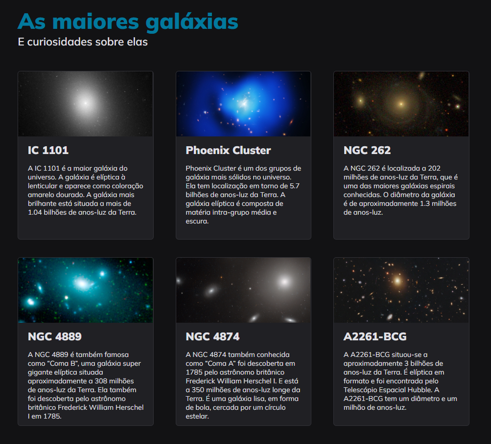

<h1 align="center"> Projeto 05 Explorer </h1>

Desenvolvido durante as aulas do Explorer na plataforma da Rocketseat.

  <a href="#-tecnologias">Tecnologias</a>&nbsp;&nbsp;&nbsp;|&nbsp;&nbsp;&nbsp;
  <a href="#-projeto">Projeto</a>&nbsp;&nbsp;&nbsp;|&nbsp;&nbsp;&nbsp;
  <a href="#memo-licença">Licença</a>

  Desktop
  

 

## Tecnologias

Esse projeto foi desenvolvido com as seguintes tecnologias:

- HTML e CSS
- Git e Github
- Figma

## Projeto

Uma página com alguns cards contando um pouco sobre as galáxias conhecidas, desenvolvido como uma introdução ao grid.

## Licença

Esse projeto está sob a licença MIT.

---

